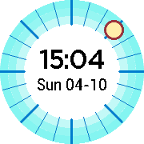

# Blue Sky

A custom watchface for Pebble Round devices.

Before submitting a pull request, please review
[CONTRIBUTING.md](CONTRIBUTING.md).

Licensed under Apache 2.0, see [LICENSE](LICENSE).

This is not an official Google product.

## Installation

Since this app is not yet available in the [Pebble Appstore][], it can only be
installed using developer tools.

Install the watchface:

1. Install the [Pebble SDK][].
2. Learn how to tell the command line tools where your watch is: [Pebble
   Tools][].
3. `cd bluesky-watchface/pebble`
4. `pebble build`
5. `pebble install`

[Pebble Appstore]: https://apps.getpebble.com
[Pebble SDK]: https://developer.getpebble.com/sdk
[Pebble Tools]: https://developer.pebble.com/guides/tools-and-resources/pebble-tool/

Install the Android companion app:

1. Install the [Android SDK][].
2. Set the `ANDROID_HOME` environment variable to absolute path of the `sdk`
   directory.
2. `cd bluesky-watchface/android`
3. `./gradlew build`
4. `./gradlew installDebug`
5. Launch the companion app.  Until a newly installed app is launched for the
   first time, Android will not let it receive intents like those the [Android
   Pebble App][] sends when the Blue Sky watchface sends messages to the phone.

[Android SDK]: https://developer.android.com/studio/releases/sdk-tools.html
[Android Pebble App]: https://play.google.com/store/apps/details?id=com.getpebble.android.basalt
