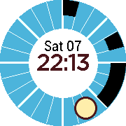

# Blue Sky

Blue Sky is a watchface that shows the Sun as an hour hand against the blue
sky.  Calendar events are displayed as buildings in a city's skyline around a
12 or 24 hour face.  Shorter events resemble tall towers while longer events
look more like wide warehouses.  While Pebble's built in timeline feature makes
it easy to find out more about these events, a companion app is required to get
the same information into the watch face itself.  Only Android is supported.

Before submitting a pull request, please review
[CONTRIBUTING.md](CONTRIBUTING.md).

Licensed under Apache 2.0, see [LICENSE](LICENSE).

This is not an official Google product.

## Installation

Since this app is not yet available in the [Pebble Appstore][], it can only be
installed using developer tools.

Install the watchface:

1. Install the [Pebble SDK][].
2. Learn how to tell the command line tools where your watch is: [Pebble
   Tools][].
3. `cd bluesky-watchface/pebble`
4. `pebble build`
5. `pebble install`

[Pebble Appstore]: https://apps.getpebble.com
[Pebble SDK]: https://developer.getpebble.com/sdk
[Pebble Tools]: https://developer.pebble.com/guides/tools-and-resources/pebble-tool/

Install the Android companion app:

1. Install the [Android SDK][].
2. Set the `ANDROID_HOME` environment variable to absolute path of the `sdk`
   directory.
2. `cd bluesky-watchface/android`
3. `./gradlew build`
4. `./gradlew installDebug`
5. Launch the companion app.  Until a newly installed app is launched for the
   first time, Android will not let it receive intents like those the [Android
   Pebble App][] sends when the Blue Sky watchface sends messages to the phone.

[Android SDK]: https://developer.android.com/studio/releases/sdk-tools.html
[Android Pebble App]: https://play.google.com/store/apps/details?id=com.getpebble.android.basalt

## To Do

The main task right now is to fix the flow of communication.  It's been driven
by Pebble-side logic, but should be driven by the device with the larger
battery.

- [ ] Send periodic agenda updates from Android, no more than a few times per
  hour, maybe much less.

- [ ] Send agenda updates from Android in response to change notifications from
  Android's Calendar Content Provider.

- [ ] Send agenda capacity from Pebble only in response to inbox errors or
  prolonged silence, and never more than a few times per day.

See [doc/faults.md](doc/faults.md) for more details.

Once the above is complete, it'll be time to fix up the user interface.

- [ ] Give the companion application a reasonable interface.  At the very
  least, a material themed status indicating whether the watch face is up to
  date.

- [ ] Make the present and future events that are displayed right next to each
  other in the current version more visually distinct.

Finally, a bit more work can be done to polish things up and publish this for
anyone to use.
